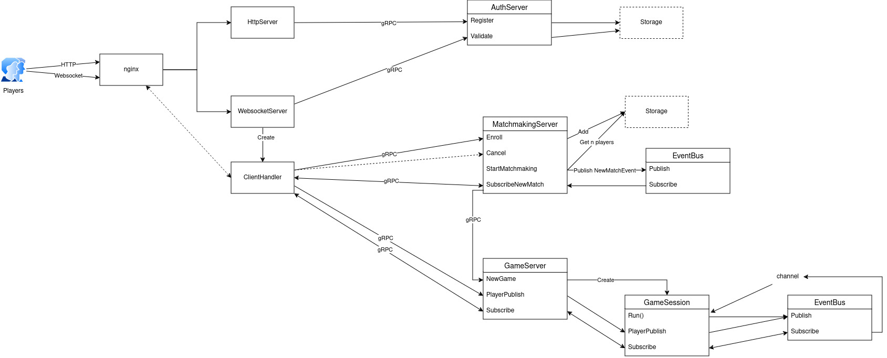

# Xenoblast

A bomberman-like game made of Phaser.js and go.

# Setup

```
cd backend && make setup
cd deploy/docker-compose && docker compose build
cd frontend && npm run proto-js && npm run proto-ts
```

# Run

```
cd deploy/docker-compose && cp .env.example .env && docker compose up -d
cd frontend && npm run dev
```

Then check http://localhost:8080

# Backend architecture



## Highlights

### gRPC

Using [protobuf](https://github.com/golang/protobuf) & [protobuf-cli](https://www.npmjs.com/package/protobufjs-cli)

- [backend/proto/](./backend/proto/)
- [backend/internal/pkg_proto/)](./backend/internal/pkg_proto/)
- [frontend/src/pkg_proto/](./frontend/src/pkg_proto/)

### Dependency injection

Using [uber-go/fx](https://github.com/uber-go/fx)

- [dependency_injection.go](./backend/internal/dependency_injection/dependency_injection.go)
- [main.go](./backend/cmd/main/main.go)
- [frontend_test.go](./backend/test/frontend_test.go)

### Event bus

- [event_bus.go](./backend/internal/event_bus/event_bus.go)
- [matchmaking_service/service.go](./backend/internal/service/matchmaking_service/service.go)
- [game_service/service.go](./backend/internal/service/game_service/service.go)

### State machine

- [game_service/state/state.go](./backend/internal/service/game_service/state/state.go)
- [test/frontend_player.go](./backend/test/frontend_player.go)

### Telemetry

Using [open telemetry SDK](https://opentelemetry.io/docs/languages/go/getting-started/) & [collector](https://opentelemetry.io/docs/collector/)

- [telemetry/providers.go](./backend/internal/telemetry/providers.go)
- [telemetry/websocket_metrics.go](./backend/internal/telemetry/websocket_metrics.go)
- [websocket_service/client_handler.go](./backend/internal/service/websocket_service/client_handler.go)
